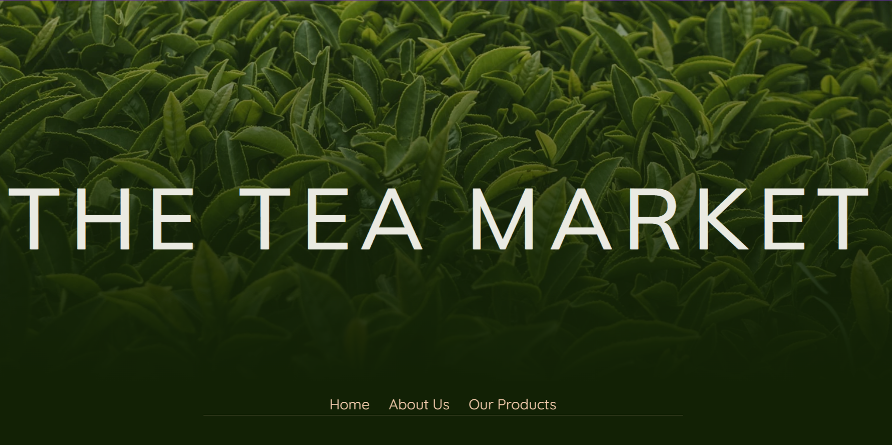

# The Tea Market

Benvenuti in **The Tea Market**, un progetto front-end che ho sviluppato con passione per rappresentare un mercato online di tè. Questo sito web responsive offre un'esperienza utente moderna e coinvolgente, grazie all'utilizzo di tecnologie come HTML, CSS, JavaScript, Bootstrap e AOS.

## Obiettivo del Progetto
L'obiettivo principale era creare un'interfaccia utente intuitiva e visivamente accattivante per un e-commerce di tè. Il sito include animazioni dinamiche, una barra di navigazione interattiva, sezioni di prodotto con immagini cliccabili e un modulo di iscrizione alla newsletter. Tutto è stato progettato per garantire un layout moderno e funzionale ad una possibile futura implementazione della parte back-end.

## Tecnologie Utilizzate

 - *HTML5*
 - *CSS3*
 - *JavaScript*
 - *Bootstrap*
 - *AOS (Animate On Scroll)*

## Struttura del Progetto

Il progetto è organizzato nei seguenti file:

- **index.html**: La homepage del sito, che presenta l'introduzione con un'immagine evocativa, le sezioni dei prodotti, le informazioni principali e le categorie, il tutto reso accattivante e professionale dalle animazioni fatte con JavaScript.

- **productsPage.html**: Una pagina dedicata alla visualizzazione dettagliata dei prodotti disponibili, ognuno dei quali ha un'icona placeholder, un nome ed un prezzo. L'utente ha la possibilità di interagire con l'elenco dei prodotti impostando dei filtri e aggiungendo una stellina per selezionarli tra i preferiti. I prodotti presenti sono inseriti attraverso la logica presente nel file *products.js*.
[Pagina prodotti con filtri](media/previews/productsPrev.png)

- **style.css**: Il file CSS che definisce lo stile del sito, inclusi colori, font e layout responsivo.
[Sezione con i numeri dell'azienda e footer](media/previews/numbersPrev.png)

- **main.js**: Il file JavaScript principale che gestisce l'interattività del sito, come la navigazione e le animazioni. Ecco le funzionalità principali: 
    - Rotazione dell'immagine della foglia si attiva con lo scroll, creando un effetto visivo dinamico.
    [Gif fogliolina che ruota](media/previews/leaf.gif)

    - Navbar cambia comportamento al variare dello scroll: appare o scompare a seconda della posizione della pagina. 
    - Animazione per il conteggio progressivo di numeri, come fattorie, lavoratori e varietà, che inizia solo quando l'elemento entra nella vista del browser. 
    [Gif animazione dei numeri](media/previews/numbers.gif)

    - Sezione "Nuovi Articoli" che mostra i tè più recenti, aggiungendoli dinamicamente con immagini e prezzi. 
Questi effetti combinano animazioni fluide e interazioni utili per un sito moderno e coinvolgente. 

- **products.js**: Contiene la logica per la gestione e visualizzazione dei prodotti, interagendo con il file *products.json*. Ecco le principali funzionalità più nel dettaglio:
    - I prodotti vengono creati dinamicamente a partire da un file JSON con la funzione fetch(), con la possibilità di visualizzare i dettagli di ciascun prodotto in card interattive. 
    - Le card mostrano anche un'icona per aggiungere ai preferiti, che cambia al click. 
    - Sono stati implementati filtri per categoria, prezzo e ricerca per parola, permettendo all'utente di cercare e selezionare i prodotti in modo più mirato. I filtri agiscono in combinazione grazie a una funzione di "global filter" che aggiorna le card visibili in base alle preferenze selezionate dall'utente.

- **products.json**:  file JSON che contiene i dati dei prodotti: nome, descrizione, prezzo e immagini.

- **media/**: cartella che contiene tutte le immagini utilizzate nel sito.

## Design e Stile

Per il design, ho scelto una combinazione di colori che trasmette eleganza e naturalezza:
- **Sfondo**: rgb(18, 33, 5)
- **Testo titoli**: rgb(234, 234, 226)
- **Testo paragrafi**: rgba(234, 234, 226, 0.59)
- **Colore accento**: rgb(247,206,175)

I font utilizzati sno:
- **Mulish** per i titoli
- **Quicksand** per i paragafi

Queste scelte contribuiscono a creare un'esperienza visiva coerente e piacevole per l'utente. I fonts sono stati presi da Google Fonts.

## In Conclusone..

Questo progetto rappresenta un passo significativo nel mio percorso come sviluppatrice full-stack. Attraverso **The Tea Market**, ho potuto approfondire le mie competenze in sviluppo web, design responsivo e interattività. Sono entusiasta di continuare a crescere professionalmente e di contribuire con la mia passione e dedizione a progetti innovativi.

Per ulteriori informazioni, non esitare a contattarmi!
---

